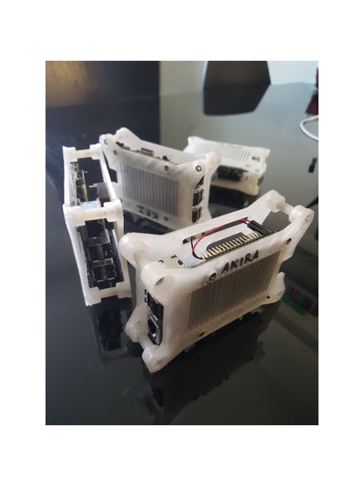
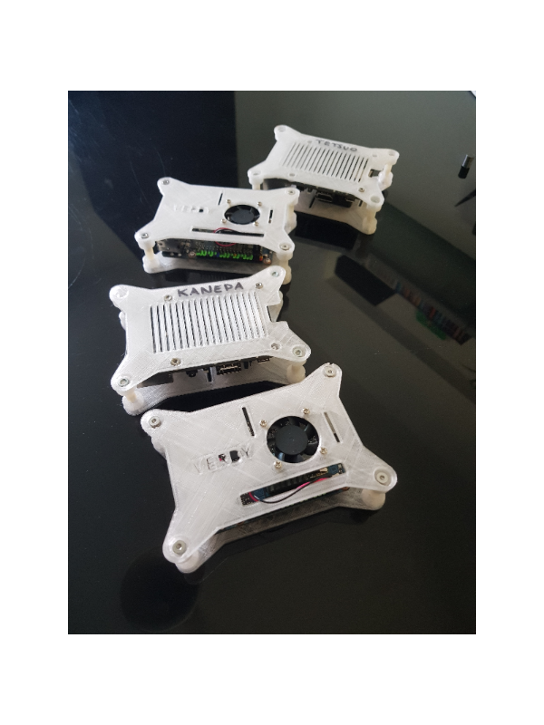
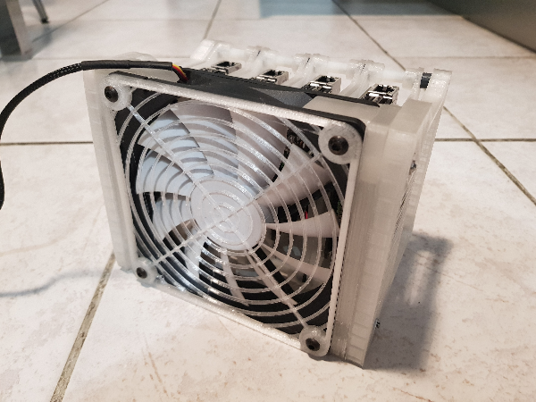
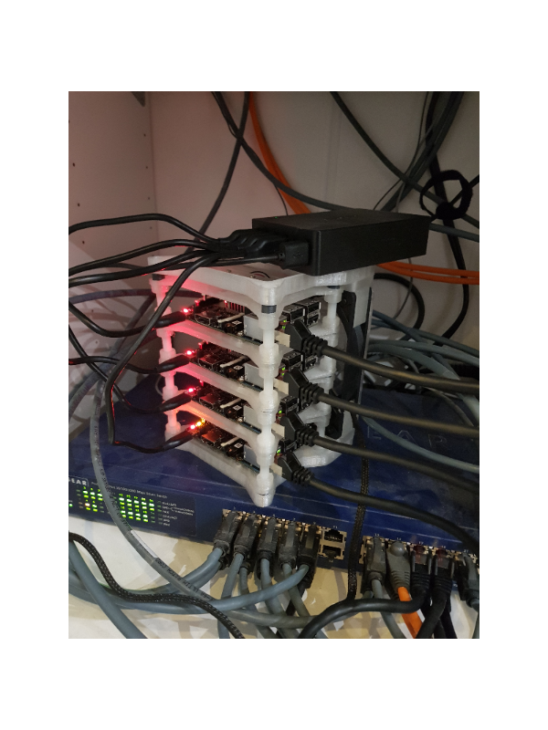
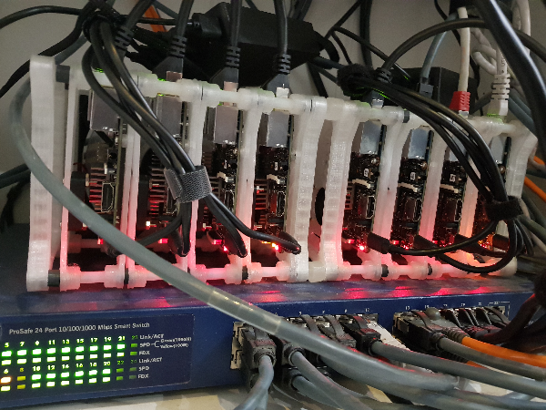
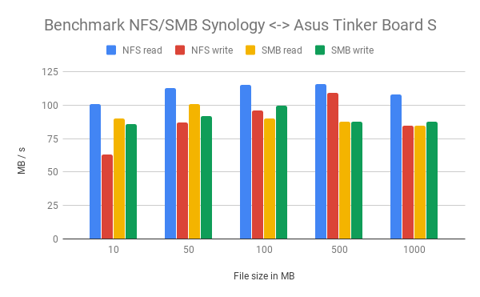

# Single Board Computing

New docker swarm with 8 [Asus Tinker Board S](https://www.asus.com/us/Single-Board-Computer/Tinker-Board-S/)  
  
## Hardware
  
### Specification
  
| Type | Values |
|----------|:---------:|
| SBC | Asus Tinker Board S |
| Cpu | Rockchip Quad-Core RK3288 processor |
| Ram | 2Go Dual Channel DDR3 |
| eMMC | 16Go |
| Ethernet | 1x1Gb |
  
### Case
  
Cases printed with [Neva Magis](https://dagoma.fr/neva-magis.html) by Dagoma, original design find on [Thingiverse](https://www.thingiverse.com/thing:3352189)  
  
Some pictures of my project :  

  
## OS
  
Using [DietPi](https://dietpi.com/) OS cause it's fully optimized according to this hardware.  
  
Considering low storage support for these SBC, mounted shares are used. Here is why I choose NFS :  
  
