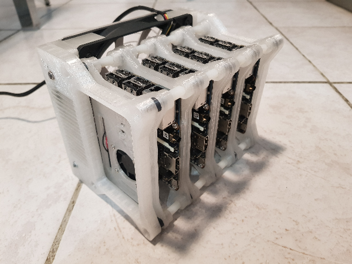

# Single Board Computing


New docker swarm with 8 [Asus Tinker Board S](https://www.asus.com/us/Single-Board-Computer/Tinker-Board-S/)  
  
## Hardware
  
### Specification
  
| Type | Values |
|----------|:---------:|
| SBC | Asus Tinker Board S |
| Cpu | Rockchip Quad-Core RK3288 processor |
| Ram | 2Go Dual Channel DDR3 |
| eMMC | 16Go |
| Ethernet | 1x1Gb |
  
### Case
  
Cases printed with [Neva Magis](https://dagoma.fr/neva-magis.html) by Dagoma, original design find on [Thingiverse](https://www.thingiverse.com/thing:3352189)  
  
Some pictures of my project :  





  
## OS
### Distribution

Using [DietPi](https://dietpi.com/) OS because it's fully optimized according to this specific hardware. And, of course, it's **Debian**.  
Considering low storage support for these SBC, mounted shares are used. Here is why I choose NFS :  
  
  
  
These were my firsts toughts but running persistent storage for docker over NFS is a big mistake especailly when used for DB.  
  
After many try, switching to **Armbian** Debian 10 with kernel compile  
Using this [guide](https://docs.armbian.com/Developer-Guide_Build-Preparation/)  
  
#

### Configuration
First installation was straightforward ! System menu help me to :
* configure basic access :
  * users passwords
  * hostname
  * IP
* install optimized software for ARMv7 (wich is 32 bits) such as :  
  * docker
  * OpenSSL
  
Prior to automate all the operations some packages are needed to use **Ansible** :  
```
apt-get install python3 python3-apt net-tools nfs-common libipset-dev -y
```

### Ansible
All the configurations are done with ansible but due to **Dietpi** distribution, automate mount share was a bit hard.  
**Dietpi** monitor /mnt/ and fstab with internal services so I have to :  
* not touch /etc/docker/daemon.json prior to move /mnt/dietpi_userdata on nfs share : /mnt/user_data/dietpi_userdata

Ansible [roles](roles/README.md) are documented.